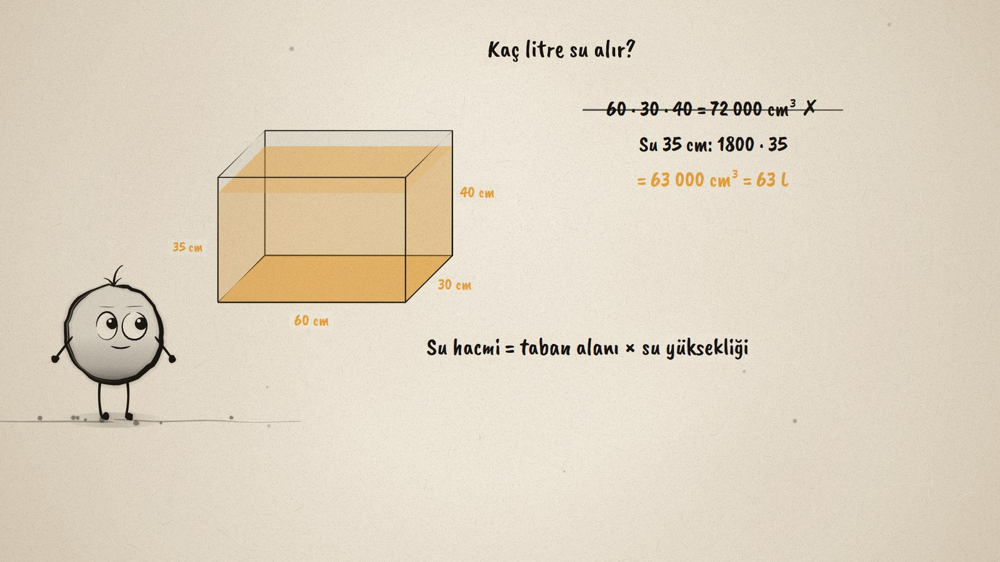
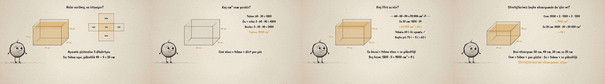

# Akvaryum Problemi · Surface Area and Volume Problems

**▶ Tarayıcıda izleyin / Watch in the browser:** https://hakanatas.github.io/akvaryum-problemi/ 
**⬇ MP4 + altyazılar / MP4 + subtitles:** [Releases](https://github.com/hakanatas/akvaryum-problemi/releases) 
**✎ Kullanılan istem / The prompt behind it:** [PROMPT.md](PROMPT.md) 
**🎞 Bütün filmler / All films:** [Nokta'nın Filmleri](https://hakanatas.github.io/nokta-filmleri/?sinif=7)

> **TR —** 7. sınıf matematik "Geometrik Nicelikler" temasındaki MAT.7.4.6 öğrenme çıktısı için hazırlanmış, tamamen JavaScript ile çizilen 92 saniyelik mürekkep animasyonu. Üstü açık cam bir akvaryum: 60 cm, 30 cm, 40 cm. Kaç cm² cam gerekir, üstten 5 cm boş kalırsa kaç litre su alır? Önce bileşenler belirleniyor (cam: taban ve dört yan yüz; su: yükseklik 35 cm), cam bir açınımla gösteriliyor ve su tahmin ediliyor (yaklaşık 60 L). Cam hesaplanıyor: 1800 + 4800 + 2400 = 9000 cm²; kapalı kutudan kapağı çıkararak kontrol ediliyor. Su için bütün kutunun hacmini alan strateji bırakılıyor; taban alanı × su yüksekliği: 1800 · 35 = 63 000 cm³ = 63 L, tahminle uyumlu, ve başka bir yolla (72 L − 9 L) doğrulanıyor. Son olarak aynı stratejiler 50 × 40 × 30 cm'lik yeni bir akvaryumda deneniyor: 7400 cm² cam, 50 L su. Altyazılar Türkçe, İngilizce ya da ikisi birlikte seçilebilir.

A 92-second ink animation for **7th-grade maths**. Nokta, the ink character from [The Learning Ink](https://github.com/hakanatas/the-learning-ink), is the guide again. The tank is drawn by `tank` in `scenes/scene1.js` with each of its five glass faces able to glow on its own, so the same drawing shows which faces are being added, and the water is a separate layer whose height follows the story (35 cm, then the full 40 cm of the wrong strategy, then back to 35).

## Learning outcome

MEB, Türkiye Yüzyılı Maarif Modeli, Ortaokul Matematik, 7th grade, "Geometrik Nicelikler" theme:

**MAT.7.4.6. Günlük hayat durumlarında dikdörtgenler prizmaları ile modellenen cisimlerin yüzey alanı ve hacmine yönelik problem çözebilme**
- a) Dikdörtgenler prizmaları ile modellenen cisimlerin yüzey alanı ve hacmine yönelik problemde ilgili matematiksel bileşenleri (şekil, cisim, uzunluk, alan, yükseklik gibi) belirler.
- b) Matematiksel bileşenler arasındaki ilişkileri belirler.
- c) Problem bağlamındaki temsilleri farklı temsillere dönüştürür.
- ç) Matematiksel temsillere dönüştürdüğü problemi kendi ifadeleri ile açıklar.
- d) Problemin sonucuna ilişkin tahminde bulunarak işlemleri gerçekleştirmek için stratejiler geliştirir.
- e) Belirlediği stratejileri çözüm için uygular.
- f) Çözüm yollarını kontrol eder ve çözüme ulaştırmayan stratejiyi değiştirir.
- g) Problemin çözümü için kullandığı veya geliştirdiği stratejileri gözden geçirerek alternatif çözüm yollarını değerlendirir.
- ğ) Kullandığı strateji veya stratejileri farklı problemlerin çözümlerine geneller.
- h) Genellemenin geçerliliğini matematiksel örneklerle değerlendirir.

## Scenes

| # | Time | Scene | What happens | Outcome |
|---|---|---|---|---|
| 1 | 0–10 s | Problem | An open aquarium, 60 × 30 × 40 cm: how much glass, how much water? | a |
| 2 | 10–28 s | Bileşenler | Glass = bottom + four walls, water height 35 cm; the net; an estimate of about 60 L. | a, b, c, ç, d |
| 3 | 28–46 s | Cam | 1800 + 4800 + 2400 = 9000 cm², checked as 10 800 − 1800. | e, f, g |
| 4 | 46–64 s | Su | The whole-box strategy is dropped; 1800 · 35 = 63 L, checked by the estimate and by 72 L − 9 L. | e, f, g |
| 5 | 64–80 s | Genelle | A 50 × 40 × 30 cm aquarium: 7400 cm² of glass, 50 L of water. | ğ, h |
| 6 | 80–92 s | Aklında kalsın | Identify, represent, estimate, solve, check, try another way. | a–h |

## Running it

- **Preview:** double-click `index.html` (it works offline).
- **MP4:** run `npm install` once, then `npm run export -- --format=horizontal --captions=tr`.
- **Subtitles and narration:** `npm run srt` writes `out/captions_*.srt` and `narration_notes.txt`.
- **Editing:**
  - Caption text, timings and narration notes: `captions.js`
  - Everything on screen is drawn by `LI.world(t)` in `scenes/scene1.js` (the tanks, the water, the net, the steps, the words); the other scenes only set the camera.
  - Nokta's poses: `src/draw/film.js`; layout for 16:9 and 9:16: `src/draw/kd.js`

It uses the same engine as The Learning Ink: `renderFrame(t)` as a pure function of time, seeded randomness, and frame-by-frame export.

## Lisans · License

**TR —** Bu film ve kodu [Creative Commons Atıf-GayriTicari 4.0 Uluslararası (CC BY-NC 4.0)](https://creativecommons.org/licenses/by-nc/4.0/deed.tr) lisansıyla paylaşılır. Ticari olmayan her amaçla (derste, okulda, eğitim materyalinde) kopyalayabilir, paylaşabilir ve değiştirebilirsiniz; ancak **kaynak göstermek zorunludur**: eser sahibinin adı ve bu deponun bağlantısı belirtilmeden kullanılamaz. Ticari kullanım (satış, ücretli ürün ya da yayın) için izin alınmalıdır.

**EN —** This film and its code are licensed under [Creative Commons Attribution-NonCommercial 4.0 International (CC BY-NC 4.0)](https://creativecommons.org/licenses/by-nc/4.0/). You may copy, share and adapt them for non-commercial purposes, but **attribution is required**: they may not be used without crediting the author and linking to this repository. Commercial use requires permission.

Atıf örneği / Required credit: *“Akvaryum Problemi”, Hakan Ataş, Nokta'nın Filmleri — https://github.com/hakanatas/akvaryum-problemi — CC BY-NC 4.0*
